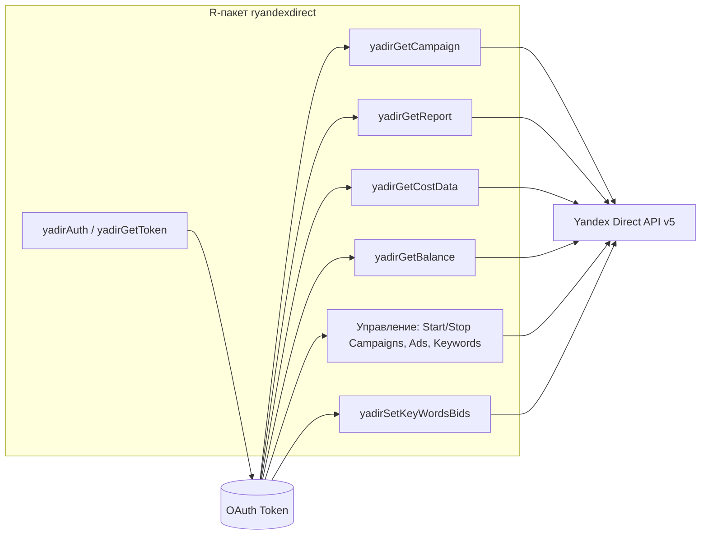
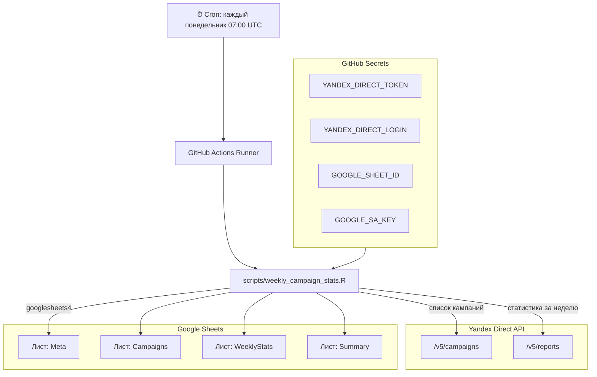
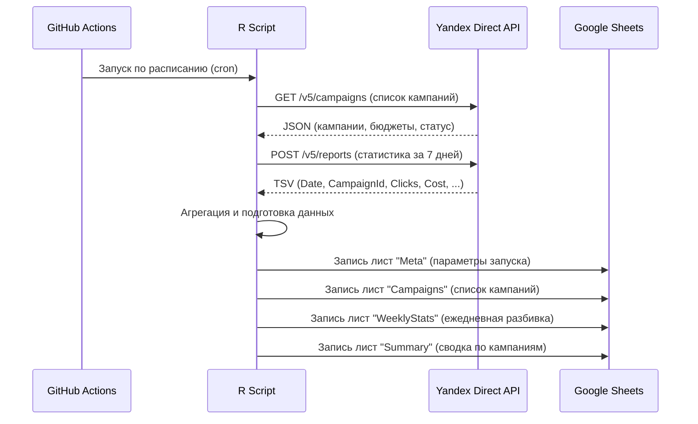

# ryandexdirect — Архитектура и обзор

## Общая архитектура пакета

## Еженедельный экспорт статистики (GitHub Actions)

## Потоки данных

## Структура Google Sheets

| Лист | Содержимое |
|------|-----------|
| **Meta** | Логин, период, дата генерации, итоги |
| **Campaigns** | Полный список кампаний с бюджетами и статусами |
| **WeeklyStats** | Подневная статистика: показы, клики, расход, CTR, CPC, конверсии |
| **Summary** | Агрегация за неделю по кампаниям: общие расходы, клики, CPA |

## Необходимые секреты (GitHub Secrets)

| Секрет | Описание |
|--------|----------|
| `YANDEX_DIRECT_TOKEN` | OAuth-токен Яндекс.Директ |
| `YANDEX_DIRECT_LOGIN` | Логин аккаунта Яндекс.Директ |
| `GOOGLE_SHEET_ID` | ID целевой Google-таблицы |
| `GOOGLE_SA_KEY` | JSON-ключ сервисного аккаунта Google (полное содержимое) |
