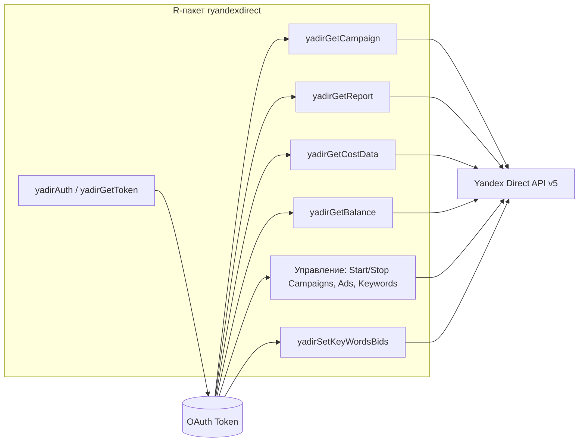
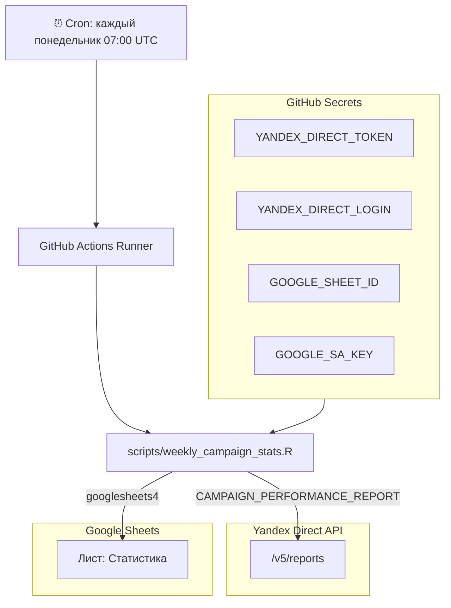
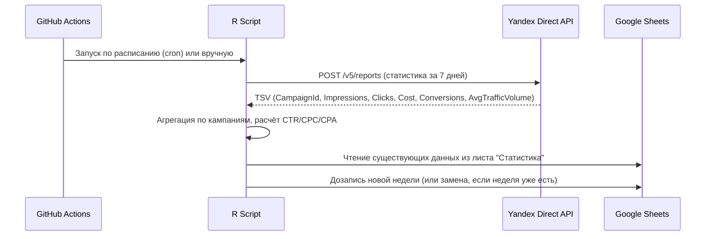

# ryandexdirect — Архитектура и обзор

## Общая архитектура пакета

## Еженедельный экспорт статистики (GitHub Actions)

## Потоки данных

## Структура Google Sheets

Одна вкладка **«Статистика»** — данные накапливаются понедельно:

| Столбец | Описание |
|---------|----------|
| **Неделя** | Метка недели, напр. `W08 (18.02–24.02)` |
| **#** | Сортировочный ключ, напр. `2026-W08` |
| **Аккаунт** | Логин аккаунта/организации Яндекс.Директ |
| **Кампания** | Название кампании |
| **Показы** | Сумма показов за неделю |
| **Клики** | Сумма кликов за неделю |
| **Расход, ₽** | Сумма расходов за неделю (с НДС) |
| **CTR, %** | Click-through rate |
| **CPC, ₽** | Средняя цена клика |
| **Конверсии** | Сумма конверсий за неделю |
| **CPA, ₽** | Средняя цена конверсии |
| **Ср. объём трафика** | Средний объём трафика (AvgTrafficVolume) |

## Необходимые секреты (GitHub Secrets)

| Секрет | Описание |
|--------|----------|
| `YANDEX_DIRECT_TOKEN` | OAuth-токен Яндекс.Директ (с правом `passport:business` для организаций) |
| `YANDEX_DIRECT_LOGIN` | Логин аккаунта или организации Яндекс.Директ (напр. `porg-xxx` для паспортной организации) |
| `GOOGLE_SHEET_ID` | ID целевой Google-таблицы (из URL) |
| `GOOGLE_SA_KEY` | JSON-ключ сервисного аккаунта Google (полное содержимое файла) |
